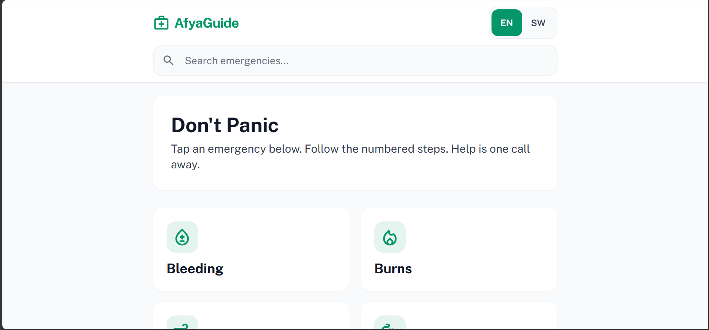

# AfyaGuide — First Aid Emergency Companion

🔗 **Live Demo:** https://gracereece.github.io/afya-guide/

---

## 📸 Preview



## 🌍 The Mission
AfyaGuide is a mobile-first, offline-ready web application designed to bridge the "Golden Hour" gap in African emergency healthcare. It provides instant, icon-driven first-aid instructions to bystanders and family members before professional medical help arrives.

## 🧐 Problem Analysis
In many African contexts, emergency response is hindered by distance, traffic, and high data costs. 
- **The Gap:** Most medical apps are heavy, English-only, and require high-speed internet.
- **The Risk:** In emergencies, people panic and may use incorrect traditional remedies.
- **The Constraint:** Our target user (e.g., Mama Grace, a 42-year-old market trader) often has a low-end device, limited data, and shared family phone usage.

## ✨ Key Features
- **Inclusive Design:** Large, high-contrast text and buttons for elderly-friendly navigation.
- **Visual Literacy:** Google Material Symbols allow users to identify emergencies (Snake Bite, Burns, Bleeding) even with low literacy.
- **Ubuntu Language Toggle:** Instant switching between English and Swahili (expandable to Yoruba, Igbo, Hausa).
- **Zero-Latency (Offline-First):** Built with Vanilla JavaScript and no external databases to ensure instant loading on 2G/EDGE networks.
- **Don't Panic UI:** A clean, calming aesthetic designed to reduce user stress during a crisis.

## 🛠️ Tech Stack
- **Frontend:** HTML5, Tailwind CSS
- **Logic:** Vanilla JavaScript (ES6+)
- **Icons & Fonts:** Google Material Symbols & Public Sans
- **Deployment:** Vercel

## 🏛️ Design Philosophy (The "Safari" Principles)
- **The Listening Heart:** Designed based on real-world constraints like "Time Poverty" and "Data Budgeting."
- **Constraints-Aware:** We treat "Data like Water"—every kilobyte has a human cost. By avoiding heavy videos or high-res images, we save the user's money.
- **The Grandmother Test:** The interface was tested for simplicity; if a grandmother can’t use it in 10 seconds, it’s not ready.

## 🚀 How to Run Locally
1. Clone the repo:
   ```bash
   git clone https://github.com/[GraceReece]/afyaguide.git


🤝 Harambee (Credits & Commitment)
Built as a Capstone Project for the PLP Safari Scholarship.
Commitment: As a builder, I commit to creating technology that uplifts the community, respects human dignity, and breaks barriers to essential information.
